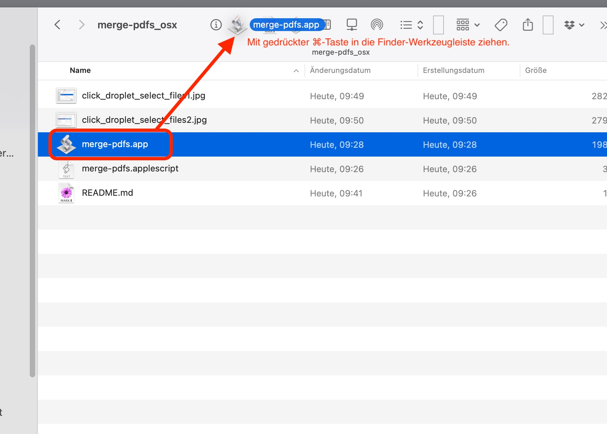
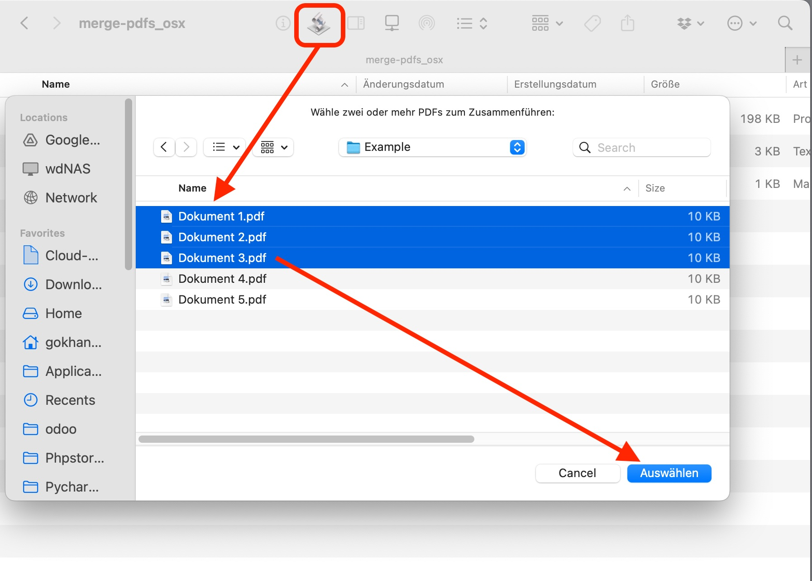
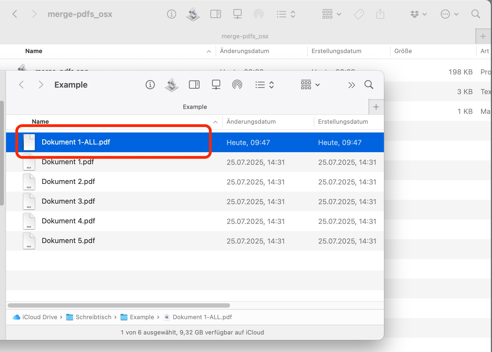

# merge-pdfs (Finder-Button-kompatible Droplet-App)

Dieses AppleScript erzeugt eine kleine App, die mehrere ausgewählte PDF-Dateien in der übergebenen Reihenfolge zusammenführt und die Ausgabe als "<ErsteDatei>-ALL.pdf" im gleichen Ordner ablegt.

## Installation (Terminal, macOS)
1) Lade die Datei `merge-pdfs.applescript` herunter.
2) Öffne das Terminal und führe aus (passt ggf. den Zielpfad an):
   
```bash
   osacompile -o ~/Desktop/marge-pdfs.app /path/to/merge-pdfs.applescript
````

wenn im gleichen Verzeichnis

```bash
osacompile -o ./merge-pdfs.app ./merge-pdfs.applescript
```

3. Ziehe `merge-pdfs.app` bei gedrückter ⌘-Taste in die Finder-Werkzeugleiste, um einen Button zu erhalten.
4. Nutzung: Markiere im Finder mehrere PDFs und ziehe sie auf den Button **oder** markiere die Dateien, drücke den Button und wähle im Dialog die Dateien aus.

## Hinweise

* Die PDFs werden genau in der Reihenfolge zusammengeführt, in der sie übergeben werden (Drag\&Drop-Reihenfolge).
* Existiert bereits eine Datei mit dem Namen `*-ALL.pdf`, wird automatisch ein Zähler angehängt, z. B. `*-ALL(2).pdf`.

### Screenshots (Ablauf)

1. **App im Finder-Toolbar-Button klicken**
   
2. **Mehrere PDF-Dateien auswählen**
   
3. **Ergebnisdatei mit `-ALL.pdf` im selben Ordner**
   


